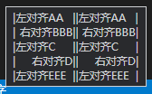

# vscode-wordcount-cjk

[English Version](./README-en.md)

> **注意：本插件基于张鹏程编写的[Word Count CJK](https://marketplace.visualstudio.com/items?itemName=holmescn.vscode-wordcount-cjk)**
> 发布于此，仅用于测试‘VSCode插件市场的发布功能’及个人私用。
> 
> 添加了一些功能：
> 1. 使用字符串数组来配置`wordcount_cjk.statusBarTooltipTemplate`:
> ```
> "wordcount_cjk.statusBarTooltipTemplate": [
>   "Line 1",
>   "Line 2",
>   "Line 3",
> ],
> ```
> 2. 为`wordcount_cjk.statusBarTooltipTemplate`添加了一些对齐辅助用的转义符号
>   因为之前的版本在windows上显示时没法对齐，TAB对齐没有效果
>   这个对齐功能**仅在以微软雅黑为系统默认字体的Windows系统**上有效，(Mac上用的别的字体，而且用TAB对齐没有问题)
>    - `\\ap`: 对齐点。 使用对齐点来切分行，每一行对应的对齐点是对齐的。
>    - `\\l`: 变长空当。与上面的`\\ap`配合使用，可以实现左/右对齐功能。使用效果如下：
>       ```
>       "wordcount_cjk.statusBarTooltipTemplate": [
>         "|左对齐AA\\l|\\ap|左对齐AA\\l|",
>         "|\\l右对齐BBB|\\ap|\\l右对齐BBB|",
>         "|左对齐C\\l|\\ap|左对齐C\\l|",
>         "|\\l右对齐D|\\ap|\\l右对齐D|",
>         "|左对齐EEE\\l|\\ap|左对齐EEE\\l|"
>       ],
>       ```
>       上面的配置将显示为如下内容:   
>       
> 3. 添加了自定义变量，用于 `wordcount_cjk.statusBarTextTemplate` 和 `wordcount_cjk.statusBarTooltipTemplate` 中的字符串模版，可以使用正则表达式来匹配。
>  ```
>  "wordcount_cjk.customVars": [
>    {
>      "name": "中文字数",
>      "regex": "[\\u4E00-\\u9FA5\\uF900-\\uFA2D]"
>    },
>    {
>      "name": "英文单词数",
>      "regex": "[a-zA-Z_]+"
>    },
>    {
>      "name": "ascii",
>      "regex": "[\\u0000-\\u00FF]"
>    },
>    {
>      "name": "空白",
>      "regex": "\\s"
>    },
>    {
>      "name": "常用标点符号",
>      "regex": "[，。；“”‘’：,.;\"']"
>    },
>    {
>      "name": "非中文非ASCII",
>      "regex": "[^\\u0000-\\u00FF\\u4E00-\\u9FA5\\uF900-\\uFA2D]"
>    },
>    {
>      "name": "空行",
>      "regex": "\\n(?=\\r?\\n)"
>    }
>  ]
>  ```
> 4. 添加调试模式配置`"wordcount_cjk.debug": true,`，启用后可以在“输出”的“wordcount_cjk”子项中，看到所有自定义变量的计算结果。
> 

VSCode 的 word count 都是老外写的，没有一个能统计中文字数的，所以我就写了一个。

## Features

在这个版本里，统计了：

1. 总字符数.
2. 非空白字符数.
3. 英语单词数.
4. 非 ASCII 码字符数.
5. CJK 字符数.

如果你不输入日语和韩语，可以把 CJK 字符数当成中文字符数。

支持如下类型文件中的统计：

1. Markdown 文件.
2. 纯文本文件.

对于其它类型的文件，比如 ReStructuredText，如果也想统计一下，我还提供了一个 `Word Count` 命令。不过，这个命令只会计数一次。如果想一直跟踪文档字数的变化，可以使用 `Word Count Activate`。要关闭计数功能，可以使用 `Word Count Deactivate` 命令。

统计结果会显示在状态栏，把鼠标悬停在状态栏上，可以看到完整的统计结果。在当然的版本中，CJK 字符是混在一起计算的。
因为我不懂日语和韩语，不知道他们应该怎么统计。如果有哪位朋友有这个需求，并且知道要怎么统计的，请在 issue 区留言
告诉我，谢谢赐教！

## Extension Settings

* `wordcount_cjk.statusBarTextTemplate`: 定制状态栏文本.
* `wordcount_cjk.statusBarTooltipTemplate`: 定制状态栏提示.
* `wordcount_cjk.regexWordChar`: 用来判断一个字符是否为英语单词字符的正则表达式.
* `wordcount_cjk.regexASCIIChar`: 用来判断一个字符是否为 ASCII 码字符的正则表达式.
* `wordcount_cjk.regexWhitespaceChar`: 用来判断一个字符是否为空白字符的正则表达式.
* `wordcount_cjk.activateLanguages`: 设置哪些类型的文件会显示字数统计。

在 `wordcount_cjk.statusBarTextTemplate` 和 `wordcount_cjk.statusBarTooltipTemplate`, 可以使用下面这些占位符:

1. `cjk`: CJK 字符数.
2. `ascii`: ASCII 码字符数.
3. `whitespace`: 空白字符数.
4. `en_words`: 英语单词数.
5. `total`: 总字符数.

从 1.1 版开始，格式化字符串可以进行计算了，比如：`共 ${total - ascii} 字`, 其中的表达式，必须是一个有效的 JavaScript 表达式。

### 英语单词字符

就是能够构成一个单词的字符。默认使用 `\w` 来检测，也就是 `[A-Za-z0-9_]`。这是正则表达式的默认值。

### ASCII 字符

在默认设置中, 使用了正则表达式 `[\u0000-\u00FF]` 来检测, 这包含了两个字符集:

1. `0000-007F`: C0 Controls and Basic Latin (ASCII)
2. `0080-00FF`: C1 Controls and Latin-1 Supplement (Extended ASCII)

### 空白字符

默认使用正则表达式的 `\s` 来检测，也就是:
`[ \f\n\r\t\v\u00a0\u1680\u180e\u2000-\u200a\u2028\u2029\u202f\u205f\u3000\ufeff]`. 也就是不只包含了 ASCII 码中的空白字符, 还包含了 Unicode 中的空白字符.

### CJK 字符

**NOTE**: 这个现在是不可配置的。

内建的正则表达式为 `[\u4E00-\u9FA5\uF900-\uFA2D]`, 包含了:

* 4E00-9FFF: CJK Unified Ideographs
* F900-FAFF: CJK Compatibility Ideographs

如果有需求的话，以后可能会把 CJK 三个字符集分开。

## TODO

1. 无

**Enjoy!**
